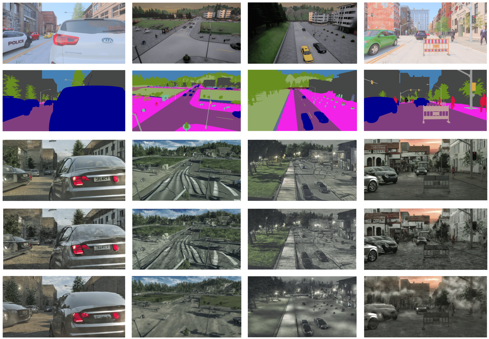
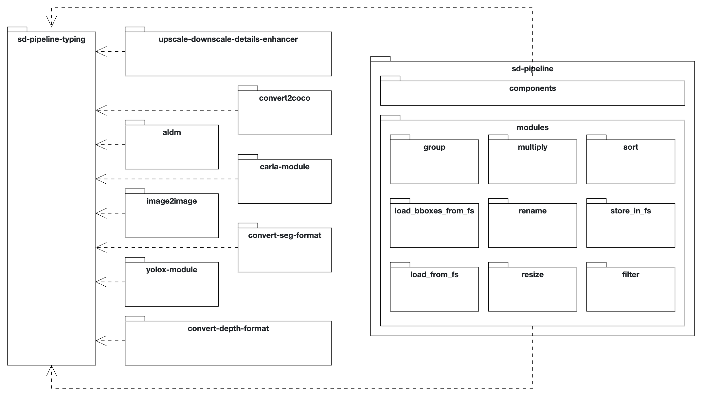

# Bridging the Domain Gap in Tracking by Diffusion
The repository for my bachelor thesis written at TUM. It contains a Stable Diffusion pipeline based on ALDM to convert 
semantic segmentation maps into realistic images.




## How does the pipeline work
The pipeline revolves around a core class, the Pipeline, which uses a builder pattern to construct and execute image 
processing tasks. It encapsulates data within a stream, which includes the image, metadata, and additional information 
like bounding boxes or depth data. The data stream is represented as a dictionary or tuple, ensuring ordered and 
immutable data flow through the pipeline. Several methods within the Pipeline class facilitate various functionalities, 
such as looping through sub-pipelines, running processes in parallel, and handling multiple image inputs.




## Install this project

This project was tested on Ubuntu and heavily relies on [CUDA](https://developer.nvidia.com/cuda-toolkit). 
Please make sure to have [CUDA](https://developer.nvidia.com/cuda-toolkit) installed before the next steps.

To install this project, first setup a [Conda](https://www.anaconda.com/download/) environment running Python version 
1.8.
```bash
conda create -n sdpipeline python=1.8
conda activate sdpipeline
```
If everything worked, please install torch next into the environment
```bash
conda install torch
```
For the next step [PDM](https://pdm-project.org/en/latest/) has to be installed. Please refer to the 
[official page](https://pdm-project.org/en/latest/) for installation or use:
```bash
conda install pdm
```
After that the project can be installed by using the following command:
```bash
python -m pdm install
```
This should install all modules inside this repository in editable mode. If you want to install them in production
mode please use:
```bash
python -m pdm install --prod
```
For installing only selected modules please modify the pyproject.toml file accordingly


## Installing weights and config files for different modules
To make the different large modules work often configuration files has to be placed into the data folder.
Please refer to the different modules for detailed instruction.

## Generating the results in the bachelor thesis
To generate the results from the bachelor thesis by yourself you need all modules installed.
#### For the object detection part please refer to 

- [9_aldm_large.py](src%2F9_aldm_large.py)
- [10_aldm+I2I_seg_large.py](src%2F10_aldm%2BI2I_seg_large.py)
- [11_aldm+I2I_seg_dep_large.py](src%2F11_aldm%2BI2I_seg_dep_large.py)
- [12_aldm+I2I_seg_dep_large_first_person.py](src%2F12_aldm%2BI2I_seg_dep_large_first_person.py)

for generation,

- [3_coco.py](src%2F3_coco.py) (Synthehicle)
- [scripts](scripts) (MUAD)

for dataset generation and

- [4_yolox-x.py](src%2F4_yolox-x.py)

for the object detection via yolox.

All resulting yolox checkpoints can also be found via 
[this link](https://syncandshare.lrz.de/getlink/fiEHcM8XqKXTFgSE1SPq9/results).

#### For object tracking and RMSE refer to:

- [1_aldm.py](src%2F1_aldm.py)
- [13_consistency.py](src%2F13_consistency.py)
- [14_consistency + I2I_comp.py](src%2F14_consistency%20%2B%20I2I_comp.py)

for image generation and

- [scripts](scripts)

for testing. The results can also be found in the scripts (for RMSE in the plot.py file).

## Where to test?

On the server at the chair generation and Human-Machine-Communication is a deployed version of this code. 
You can find there also all scripts, datasets and other results like the yolox weights. The conda environment
has the name "application". For more information feel free to contact me :)

## The scripts folder

The script folder contains a lot of different scripts used for converting datasets into different formats or the 
video generation part. In the futures these could be also integrated into the pipeline as modules.

## Sync & Share
The [Sync and Share link](https://syncandshare.lrz.de/folderstable) contains all generated datasets.

## Final words

A hugh thanks to the Institute for Human-Machine-Communication at TUM, Univ.-Prof. Dr.-Ing. habil. G. Rigoll 
and my advisors Philipp Wolters M.Sc. and Fabian Herzog Ph.D. for giving me a place to write my thesis and for the 
great support. 

Also hugh thanks to Sonja Nagy and Fabian Lehr for proofreading :)

